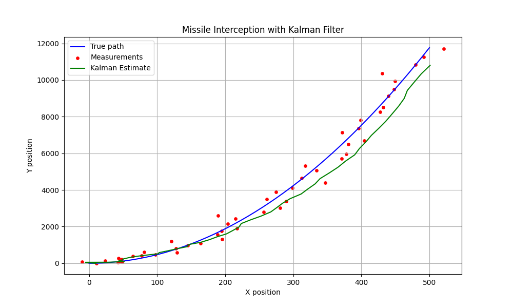
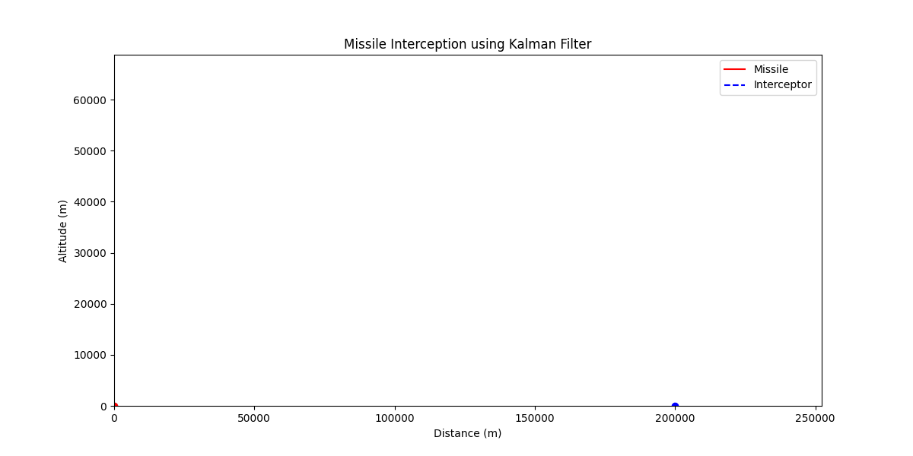

# 🎯 Missile Tracking and Interception using Kalman Filter

This project demonstrates the simulation of tracking a ballistic missile in 2D space using noisy sensor data and a Kalman Filter for state estimation. It shows how accurate prediction enables timely interception.

---

## 📊 Features

- Simulated ballistic missile trajectory
- Noisy radar-like measurements
- Real-time Kalman Filter estimation
- Visualization of true path, noisy measurements, and filtered path

---

## ▶ How to Run

```bash
pip install -r requirements.txt
python src/kalman_simulation.py
```

Output will be saved to `plots/kalman_result.png`

---

## 📁 Project Structure

```
kalman-missile-sim/
├── src/
│   └── kalman_simulation.py
├── plots/
│   └── kalman_result.png
├── requirements.txt
└── README.md
```

---

## 📷 Output Example



This figure shows:
- 🔵 Blue line → True missile path  
- 🔴 Red dots → Noisy radar measurements  
- 🟢 Green line → Estimated path using Kalman Filter

### 🎞️ Dynamic Interception Simulation

This animation shows a full missile interception scenario:

- A ballistic missile is launched at 45° and follows a realistic trajectory under gravity.
- The interceptor is launched late from 200 km away with a slightly higher speed.
- It has no prior knowledge of the missile’s path — only noisy (X, Y) measurements.
- A 2D Kalman Filter estimates the missile’s position in real-time.
- The interceptor adjusts its direction based on predictions until it reaches within 100 meters of the target.
- An explosion is triggered upon interception, and the simulation stops.



Created by Ohad Marhozi, 2025  
Simulation of stochastic control in defense systems.
