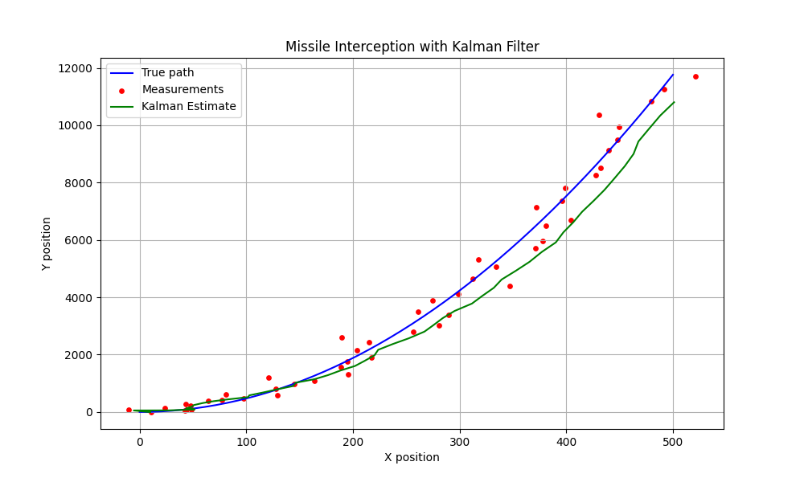

# 🎯 Missile Tracking and Interception using Kalman Filter

This project demonstrates the simulation of tracking a ballistic missile in 2D space using noisy sensor data and a Kalman Filter for state estimation. It shows how accurate prediction enables timely interception.

---

## 📊 Features

- Simulated ballistic missile trajectory
- Noisy radar-like measurements
- Real-time Kalman Filter estimation
- Visualization of true path, noisy measurements, and filtered path

---

## ▶ How to Run

```bash
pip install -r requirements.txt
python src/kalman_simulation.py
```

Output will be saved to `plots/kalman_result.png`

---

## 📁 Project Structure

```
kalman-missile-sim/
├── src/
│   └── kalman_simulation.py
├── plots/
│   └── kalman_result.png
├── requirements.txt
└── README.md
```

---

## 📷 Output Example



This figure shows:
- 🔵 Blue line → True missile path  
- 🔴 Red dots → Noisy radar measurements  
- 🟢 Green line → Estimated path using Kalman Filter

Created by Ohad Marhozi, 2025  
Simulation of stochastic control in defense systems.
